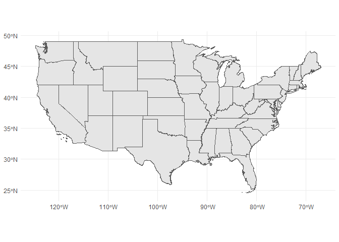
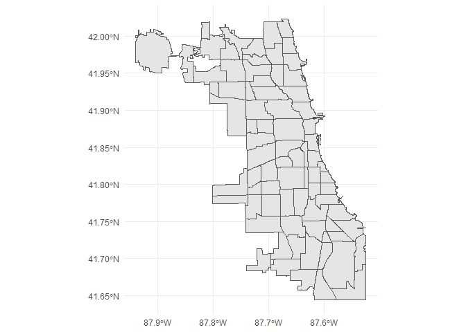

c3s2datasets README
================

# c3s2datasets

## Installation

You can install the development version of c3s2datasets from GitHub
with:

``` r
install.packages("devtools")
devtools::install_github("MACS40700/c3s2datasets")
```

## Available Datasets

The following datasets are available in this package:

| Dataset Name | Description |
|----|----|
| chicago_311 | Chicago 311 Requests (2019–2021) |
| chicago_community_areas_map | Chicago Community Areas (Current) GeoJSON |
| chicago_crimes | Sample Chicago Crime Data (2017, Source: City of Chicago Crime Data) |
| cook_county_inc_map | Cook County Incorporated Areas GeoJSON |
| illinois_baby_names | Popular Baby Names in Illinois (1910–2023) |
| instructional_staff | Distribution of U.S. Faculty Appointments by Type (1975–2011) |
| scorecard | U.S. Colleges and Universities: Admissions, Costs, and Outcomes |
| superheroes | Comic Book Superheroes and Villains (100 Characters) |
| USCongress | Sample Legislative Bills Dataset |
| us_states_map | US States Shapefile (2020, 1:5M, Census Bureau) |
| yob1880 | Popular Baby Names in the United States (1880) |
| yob2023 | Popular Baby Names in the United States (2023) |

## Examples

``` r
library(c3s2datasets)
library(skimr)
library(sf)
library(ggplot2)
```

``` r
instructional_staff
```

    ## # A tibble: 5 × 12
    ##   faculty_type   `1975` `1989` `1993` `1995` `1999` `2001`
    ##   <chr>           <dbl>  <dbl>  <dbl>  <dbl>  <dbl>  <dbl>
    ## 1 Full-Time Ten…   29     27.6   25     24.8   21.8   20.3
    ## 2 Full-Time Ten…   16.1   11.4   10.2    9.6    8.9    9.2
    ## 3 Full-Time Non…   10.3   14.1   13.6   13.6   15.2   15.5
    ## 4 Part-Time Fac…   24     30.4   33.1   33.2   35.5   36  
    ## 5 Graduate Stud…   20.5   16.5   18.1   18.8   18.7   19  
    ## # ℹ 5 more variables: `2003` <dbl>, `2005` <dbl>,
    ## #   `2007` <dbl>, `2009` <dbl>, `2011` <dbl>

``` r
superheroes
```

    ## # A tibble: 100 × 4
    ##    name            alignment gender publisher    
    ##    <chr>           <chr>     <chr>  <chr>        
    ##  1 Mystique        bad       female Marvel       
    ##  2 Joker           bad       male   DC           
    ##  3 Iron Fist       good      male   Marvel       
    ##  4 Veronica Lodge  good      female Archie Comics
    ##  5 Captain Cold    bad       male   DC           
    ##  6 Darkseid        bad       male   DC           
    ##  7 Abe Sapien      good      male   Dark Horse   
    ##  8 King Vold       bad       male   Dark Horse   
    ##  9 Captain America good      male   Marvel       
    ## 10 Archie Andrews  good      male   Archie Comics
    ## # ℹ 90 more rows

``` r
mainland <- us_states_map[!(us_states_map$NAME %in% c("Alaska", "Hawaii", "Puerto Rico",
                                        "Guam", "American Samoa", 
                                        "Commonwealth of the Northern Mariana Islands", 
                                        "United States Virgin Islands")), ]
ggplot(mainland) +
  geom_sf() +
  coord_sf() +
  theme_minimal()
```

<!-- -->

``` r
ggplot(chicago_community_areas_map) +
  geom_sf() +
  coord_sf() +
  theme_minimal()
```

<!-- -->
